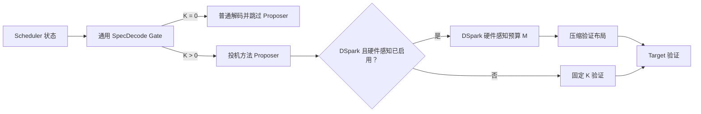
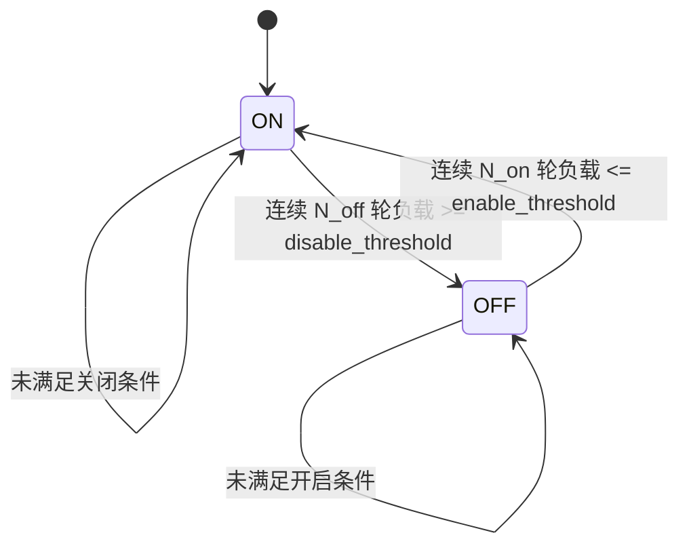
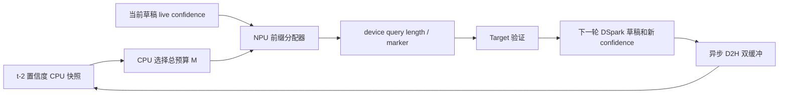

# 通用动态投机开关与 DSpark 硬件感知验证设计

## 摘要

本文设计一套面向 vLLM Ascend 的两级动态投机解码控制机制：

1. **通用动态投机开关（Generic Speculative Decoding Gate）**位于
   Scheduler 层，对 DSpark、MTP、EAGLE、N-Gram 等投机方法统一生效，负责
   判断当前调度轮是否运行 proposer，并输出本轮有效投机深度 `K`。
2. **DSpark 硬件感知验证器（DSpark Hardware-Aware Verification）**位于
   Worker 层，仅对 DSpark 生效。DSpark 已经生成固定长度草稿后，该模块结合
   置信度和 Ascend NPU 实测成本曲线，决定 Target 模型本轮实际验证的草稿总量
   `M`，并把预算分配为每个请求的连续验证前缀。

两个模块相互独立。通用 Gate 不依赖 DSpark 置信头；DSpark 硬件感知模块失效或
关闭时，通用 Gate 仍可正常控制 DSpark 的开关，DSpark 则退回固定长度验证。

## 背景

投机解码并非在所有负载下都能带来正收益。低并发或生成尾部阶段通常受内存带宽
限制，使用 proposer 生成多个候选 token 可以减少 Target forward 次数；高并发时
Target 已经充分利用设备，额外 proposer 和更大的验证 batch 反而可能降低吞吐。

vLLM 的 [动态投机解码 RFC](https://github.com/vllm-project/vllm/issues/41821)
提出了按 batch 负载动态开启或关闭投机解码的方向。已合入的
[Dynamic SD 实现](https://github.com/vllm-project/vllm/pull/32374)支持根据 batch
大小动态选择 `num_speculative_tokens`，并允许使用 `K=0` 关闭当前轮投机。

[DSpark 论文](https://arxiv.org/pdf/2607.05147)进一步指出，真实硬件的
seconds-per-step 曲线并不平滑，尤其在图模式下通常表现为台阶状。DSpark 可以利用
置信头估算每个草稿 token 被接受的概率，在保持正确性的前提下，只向 Target
提交最有价值的连续草稿前缀。

vLLM 的 [DSpark confidence-scheduled verification PR](https://github.com/vllm-project/vllm/pull/47808)
提供了置信头、异步置信度缓冲和动态验证预算的参考实现。该 PR 截至本文编写时仍
未合入，因此本设计复用其算法思想，不依赖其当前内部接口。

## 目标

- 对所有可动态调整 `K` 的投机方法提供统一、batch-level 的开启和关闭能力。
- Gate 的热路径只使用 Scheduler 已有的 CPU 状态，不引入 NPU 到 CPU 同步。
- `K=0` 时真正跳过 proposer、草稿验证和相关采样开销。
- 为 DSpark 提供基于置信度和 Ascend 实测性能曲线的细粒度验证预算。
- 兼容 ACL Graph，运行时切换不能触发临时 graph capture。
- 保持投机解码的无损语义；在首阶段 greedy 场景下做到逐 token 一致。
- 通过能力声明和明确降级策略，避免影响不支持动态形状的投机方法或 attention
  backend。

## 非目标

- 不在第一阶段为 MTP、EAGLE、N-Gram 实现置信度驱动的逐请求验证预算。
- 不训练 DSpark 置信头；运行时只负责加载、校准和推理。
- 不为不同硬件提供通用的固定阈值。Gate 阈值和 DSpark 成本表必须按部署组合
  配置或生成。
- 不在 vLLM Ascend Worker 中复制一套独立的上游 Scheduler。

## 术语

| 符号或名称 | 含义 |
| --- | --- |
| `K` | 每个请求本轮允许生成的投机 token 数，由通用 Gate 决定 |
| `K_max` | 当前投机方法配置的最大投机深度 |
| `gamma` | DSpark 一次并行生成的固定草稿长度，等价于 DSpark 的 `K_max` |
| `M` | DSpark 本轮在整个 batch 中实际提交给 Target 验证的草稿 token 总量 |
| `R` | 当前 decode 请求数 |
| SPS | seconds per step，执行一个推理 step 的耗时 |
| stale confidence | 通过异步 D2H 获取的旧置信度，只用于选择 DSpark 总验证预算 |
| live confidence | 当前草稿对应的设备侧置信度，用于分配固定的验证预算 |

## 总体架构



### 设计边界

| 模块 | 所在层级 | 适用范围 | 主要输出 |
| --- | --- | --- | --- |
| `GenericSpecDecodeGate` | Scheduler | 所有声明支持动态关闭的投机方法 | `enabled`、`K`、`reason` |
| `DSparkAdaptiveVerificationManager` | Worker/ModelRunner | 仅 DSpark | `M`、每请求验证长度和压缩布局 |

通用 Gate 负责回答“本轮是否值得运行投机方法”。DSpark 硬件感知模块负责回答
“既然已经运行了 DSpark，哪些草稿值得送给 Target 验证”。

## 通用动态投机开关

### 决策范围

Gate 使用 **batch-level** 决策。同一个 Scheduler step 使用一个全局 `K`，每个
请求仍可因为序列结束、剩余 token 上限等原因把自己的投机长度裁剪到不超过该值。

第一阶段统一采用二元控制：

\[
K_t =
\begin{cases}
0, & \text{关闭当前轮投机} \\
K_{max}, & \text{开启当前轮投机}
\end{cases}
\]

后续只有在投机方法明确声明支持时，才允许输出中间值，例如 MTP 的
`K in {0, 1, 2, 3}`。

### Scheduler 输入

所有输入均来自 Scheduler CPU 状态：

- 当前 scheduled decode 请求数；
- 当前 scheduled decode token 数；
- 当前 prefill 请求数和 prefill token 数；
- waiting queue 长度；
- KV cache 使用率；
- 当前 speculative method 和配置的 `K_max`；
- 最近若干轮 Gate 状态；
- `force_on`、`force_off` 或 `auto` 外部控制状态；
- 当前请求是否使用与投机方法不兼容的功能。

第一阶段只使用 scheduled decode 请求数，以直接复用 vLLM 现有
`num_speculative_tokens_per_batch_size`。其他输入作为后续策略扩展，不应一次性
引入多变量启发式规则。

### 决策接口

建议在上游 vLLM 定义通用策略接口：

```python
@dataclass
class SpeculationDecision:
    enabled: bool
    num_speculative_tokens: int
    reason: str


@dataclass
class SpeculationMethodCapabilities:
    supports_k_zero: bool
    supported_k_values: tuple[int, ...]
    supports_variable_k: bool


class SpecDecodeGatePolicy(Protocol):
    def decide(
        self,
        snapshot: SchedulerSnapshot,
        capabilities: SpeculationMethodCapabilities,
    ) -> SpeculationDecision:
        ...
```

能力声明用于避免在代码中散落 `if method == "mtp"` 一类条件。未知方法或不支持
`K=0` 的执行路径默认保持现有固定投机行为，并记录降级原因。

### 方法差异

| 方法类型 | 首阶段策略 | 后续可选策略 | 原因 |
| --- | --- | --- | --- |
| DSpark | `K in {0, gamma}` | 保持二元 Gate | 并行 drafter 生成整块草稿，成本接近固定 |
| MTP | `K in {0, K_max}` | 可支持多个 K | proposer 成本通常随预测层数或步数变化 |
| EAGLE/EAGLE3 | `K in {0, K_max}` | 通过能力声明支持多个 K | 多步 proposer 成本随 K 增长 |
| N-Gram/Suffix | `K in {0, K_max}` | 可按命中率扩展策略 | proposer 很轻，但 Target 验证 batch 仍有成本 |
| 未识别方法 | 保持固定投机 | 完成能力验证后接入 | 避免静默改变现有行为 |

### 滞回状态机

直接按单一 batch 阈值切换会在边界附近抖动。建议增加两个阈值和稳定轮数：



要求 `enable_threshold < disable_threshold`。状态机只改变后续 Scheduler step，不
修改已经生成的草稿。

### 控制优先级

按以下优先级生成最终决定：

1. 不兼容特性或执行路径强制关闭；
2. 管理面或训练框架显式 `force_on`/`force_off`；
3. 自动 Gate；
4. 不支持 Gate 时使用 `fallback=always_on`。

外部控制只更新 CPU 状态，不能在推理热路径等待 RPC。

### 关闭语义

`K=0` 必须满足：

- Scheduler 不为请求调度 speculative token；
- Worker 不调用 proposer；
- 不执行投机专用 rejection sampler；
- 不分配本轮草稿中间张量；
- 选择预先捕获的非投机 graph；
- 不改变请求 RNG 状态和普通采样语义。

只生成草稿后再把验证长度设置为零不能视为“关闭投机”，因为 proposer 成本已经
发生。

### ACL Graph

每种方法必须在启动阶段声明 Gate 可能输出的全部 K，并提前捕获相应图：

```text
DSpark, gamma=5: K={0, 5}
MTP, binary gate: K={0, 3}
MTP, variable K: K={0, 1, 2, 3}
```

运行时不能因为 Gate 切换发生 graph recapture。若某种方法或 attention backend
没有可用的 `K=0` graph，Gate 应自动降级为固定开启，而不是切换到未经验证的
动态路径。

### 与上游 vLLM 的关系

通用 Gate 属于调度语义，应优先放在 vLLM Scheduler，而不是 Ascend
`ModelRunner`。vLLM Ascend 的职责是：

- 声明 Ascend 执行路径支持的 K 集合；
- 捕获对应 ACL Graph；
- 提供按模型和方法生成的推荐配置；
- 上报 Ascend 侧执行和收益指标。

首阶段直接复用 vLLM 的 `num_speculative_tokens_per_batch_size`。滞回、外部 override
和通用 policy hook 适合作为上游通用能力提交，避免 vLLM Ascend 长期维护 Scheduler
分叉。

## DSpark 硬件感知验证

### 启用条件

只有同时满足下列条件才进入 DSpark 硬件感知路径：

```python
gate_decision.enabled
and speculative_method == "dspark"
and dspark_hardware_aware_verification.enabled
and model_supports_confidence_head
and execution_path_is_supported
```

否则执行固定长度 DSpark 验证。硬件感知模块失败不应自动关闭整个 DSpark，除非
通用 Gate 独立做出 `K=0` 决策。

### 置信度语义

对请求 `r` 的第 `j` 个草稿，置信头输出条件接受概率：

\[
c_{r,j} = P(\text{token }j\text{ 被接受}\mid\text{此前草稿均被接受})
\]

该 token 能实际贡献到输出的存活概率为：

\[
a_{r,j}=\prod_{i=1}^{j}c_{r,i}
\]

同一请求内 `a_{r,j}` 单调不增，因此对所有请求的合法扩展执行稳定全局排序后，
Top-M 结果天然对应每个请求的连续前缀。

置信头的训练目标由模型训练流程负责。运行时必须支持加载 checkpoint 中的
`confidence_head.*` 权重，并按草稿位置应用校准温度。若 checkpoint 没有置信头，
硬件感知模块直接禁用；若缺少校准参数，默认禁用，只有显式允许未校准运行时才可
继续，并上报醒目指标。

默认不对 confidence 应用 EMA。EMA 会改变置信度分布，需要独立的收益和校准实验
后才能作为可选策略加入。

### 吞吐目标

设本轮有 `R` 个 decode 请求，DSpark 固定生成 `gamma` 个草稿。选择全 batch 验证
预算 `M` 后，期望产出 token 数为：

\[
E(M)=R+\sum_{(r,j)\in\operatorname{TopM}}a_{r,j}
\]

硬件执行成本为：

\[
C(M)=T_{draft}(R,\gamma)
    +T_{target}(\operatorname{bucket}(R+M))
\]

选择：

\[
M^*=\arg\max_M\frac{E(M)}{C(M)}
\]

`T_target` 必须包含 Target forward、LM head、验证采样及 graph padding 的实际成本。
`T_draft` 单独建表，因为 DSpark 即使减少 Target 验证量，也通常已经支付了完整
草稿块的生成成本。

### 两级异步决策

生产路径使用“旧置信度选择容量、当前置信度分配容量”的两级决策：



- stale confidence 只能决定与当前 token 内容无关的总容量 `M`；
- live confidence 只能在固定 `M` 内对当前草稿排序；
- 设备到主机的 confidence 拷贝使用独立 stream、event 和 pinned buffer；
- 热路径禁止 `.item()`、`.cpu()`、`torch.npu.synchronize()`；
- 请求 slot 复用时必须清理 live tensor 和两个历史 buffer，防止置信度串请求。

使用旧置信度选择 `M` 后，可以在完整的台阶状硬件曲线上全局搜索，而不需要在
第一次吞吐下降时提前停止。当前 token 只影响固定容量内的排序，不影响执行容量。

### Ascend 硬件成本表

建议增加 `AscendHardwareCostTable`，启动时运行小规模 profile 并支持持久化缓存。

profile 至少拆分为：

- DSpark proposer；
- Target forward；
- LM head；
- rejection sampling；
- eager、PIECEWISE、FULL ACL Graph 下的 padding/bucket 成本。

采集规则：

- 每个点 warmup 后至少运行 5 次，取中位数；
- ACL Graph capture 范围内保存实际阶梯函数；
- 超出 capture 范围后才允许在相邻测量点间插值；
- TP/EP 场景由所有 rank 执行 profile，并使用最大耗时；
- profile 不在首个真实请求的热路径执行；
- 缓存不匹配时回退固定验证，不使用其他设备的成本表。

缓存键至少包含：

```text
SoC 型号
模型与 speculative config 哈希
dtype 和量化方式
attention backend
TP/EP/DP/PP/CP 配置
ACL Graph 模式与 capture sizes
KV block size
gamma
```

### 设备侧预算分配

设备侧 allocator 持有固定形状 confidence tensor `[max_num_reqs, gamma]`，执行：

1. 根据本轮有效请求和请求剩余 token 数生成 validity mask；
2. 对每个请求执行 `cumprod`，得到累计存活概率；
3. 对有效候选执行稳定降序排序或等价 Top-K；
4. 截取固定的 `M` 个候选；
5. 计算每个请求的连续验证长度；
6. 生成统一的 device query lengths、`cu_num_logits` 和 token marker。

所有下游 metadata 必须来自同一次分配结果。不能同时使用 stale CPU 长度构造
`cu_num_logits_np`，又使用 live NPU 长度构造 query layout，否则可能造成 logits
chunk 边界错位和跨请求数据混合。

## 配置设计

通用 Gate 直接复用上游 vLLM 的 speculative config；DSpark 硬件感知模块使用
vLLM Ascend 的 `additional_config`。当前实现只接受离线实测曲线：

```json
{
  "dspark_hardware_aware_verification": {
    "enabled": true,
    "allocation_mode": "stale_cpu",
    "profile_mode": "configured",
    "min_predicted_gain": 0.02,
    "require_calibration": true,
    "cudagraph_limit": 128,
    "draft_cost_curve": [[1, 0.31], [32, 0.42], [64, 0.57]],
    "verify_cost_curve": [[32, 0.85], [64, 0.91], [128, 1.08], [256, 1.62]]
  }
}
```

曲线点格式为 `[规模, 毫秒]`。`draft_cost_curve` 的规模是 decode 请求数，
`verify_cost_curve` 的规模是 Target 物理 token 数。上述数据只用于说明格式，不是
推荐值；必须在目标 SoC、模型、K、并行配置和 graph 配置上实测生成。

在通用 Gate 上游接口完成前，可使用现有配置表达二元策略：

```json
{
  "method": "mtp",
  "num_speculative_tokens": 3,
  "num_speculative_tokens_per_batch_size": [
    [1, 96, 3],
    [97, 512, 0]
  ]
}
```

同一配置形式可用于 DSpark、EAGLE 和其他通过能力验证的方法。

## 代码组织与改动点

### 上游 vLLM

优先复用或向上游贡献：

- `vllm/config/speculative.py`：通用 Gate 配置和策略类型；
- `vllm/v1/core/sched/scheduler.py`：Gate 决策和 `K=0` 调度语义；
- graph capture 配置：枚举方法支持的全部 K；
- iteration stats：通用 Gate 指标。

若上游暂时没有通用策略 hook，第一阶段只使用已有 batch-size lookup，不在
vLLM Ascend 中复制 Scheduler。

### vLLM Ascend

当前实现新增：

```text
vllm_ascend/worker/v2/spec_decode/dspark/
└── adaptive_verification.py
```

核心类：

- `AscendAdaptiveVerificationManager`：管理时序、降级和执行布局；
- `AsyncConfidenceRing`：管理 live tensor、双 host buffer、stream 和 event；
- `build_cost_tables_from_curves()`：把实测曲线展开为 graph 阶梯/超界插值成本表；
- `select_verification_plan()`：计算累计存活概率、全局预算和连续前缀分配。

现有代码改动：

- `vllm_ascend/models/deepseek_v4_dspark.py`
    - 增加并加载 `DSparkConfidenceHead`；
    - 停止丢弃 `confidence_head.*` 权重；
    - 提供 `compute_confidence()`。
- Qwen3 DSpark 及其他模型通过 capability 检测降级；只有模型实际提供并加载
  confidence head 时才启用硬件感知路径。
- `vllm_ascend/worker/v2/spec_decode/dspark/speculator.py`
    - 暴露本轮草稿 confidence；
    - proposer 完成后触发异步记录。
- `vllm_ascend/worker/v2/aclgraph_utils.py`
    - graph wrapper 透传 `compute_confidence()`。
- `vllm_ascend/worker/v2/model_runner.py`
    - graph dispatch 使用动态 `uniform_token_count`；
    - `execute_model()` 使用同一份压缩 SchedulerOutput 生成所有 metadata；
    - proposer 后记录 confidence；
    - 初始化并持有硬件成本表和 manager。

不要直接把所有 Ascend attention backend 标记为支持设备侧动态 query length。应按
FIA、MLA、SFA 等具体路径分别实现和验证。

## 分阶段实现

### Phase 1：通用二元 Gate（已实现）

- 复用 `num_speculative_tokens_per_batch_size`；
- 对 MTP、DSpark、EAGLE、N-Gram 等方法分别验证 `K=0`；
- `K=0` 真正跳过 proposer；
- ACL Graph 提前捕获 `K=0` 和 `K=K_max`；
- Worker 消费上游 `num_spec_tokens_to_schedule`，K=0 时通过 no-op proxy 真正跳过
  proposer；K>0 时对返回给 Scheduler 的草稿长度做一致裁剪；
- 暂不实现多变量在线策略。

### Phase 2：DSpark stale-CPU 硬件感知 MVP（已实现）

- 仅支持 MRV2 DSpark；
- 仅支持 decode-only batch；
- CPU 使用 `t-2` confidence 同时选择 `M` 和每请求验证长度；
- 保持 CPU/NPU metadata 完全一致，不修改 attention 的设备长度协议；
- 支持 eager、PIECEWISE 和已预捕获对应 token bucket 的 FULL ACL Graph；
- 首阶段限制 `temperature=0`；
- 支持 TP/EP，暂不支持 DP、PP、CP、PCP、DCP；
- 暂不支持 output logprobs、LoRA 和 structured output。

该阶段还没有使用 live confidence 排序，但不存在设备同步，可先验证成本模型、
置信头质量和实际吞吐收益。

当前实现还要求提供 `draft_cost_curve` 和 `verify_cost_curve`；缺失曲线、缺失置信头、
缺失校准温度或遇到不支持的执行场景时，会记录一次告警并回退到固定长度验证。
启动时自动 profiling、成本表持久化、指标上报和 live-rank 均保留到后续阶段。

### Phase 3：DSpark live-rank 生产路径

- stale confidence 只选择总预算 `M`；
- live confidence 在 NPU 上分配连续前缀；
- attention 使用 device marker/query length；
- ACL Graph 按总物理 token bucket 捕获；
- 每个 graph slot 使用合法输入或 dummy tail；
- 重点适配 DeepSeek V4 index/compress attention 路径；
- 下游 metadata 全部切换到同一个设备侧分配结果。

### Phase 4：通用 Gate 增强与分布式支持

- 增加滞回状态机和外部 override；
- 为明确支持的方法增加可变 K；
- 支持 RL rollout trainer 控制；
- 增加 DP 的物理 token 数和 `max_query_len` 同步；
- 支持 mixed prefill；
- 在设备随机接受逻辑完成后支持非零 temperature 的 DSpark 自适应验证。

## 兼容性与降级

| 场景 | 通用 Gate | DSpark 硬件感知 MVP | 降级行为 |
| --- | --- | --- | --- |
| Greedy decode | 支持 | 支持 | 无 |
| 非零 temperature | 沿用基础方法能力 | 首阶段不支持 | DSpark 固定验证 |
| Mixed prefill/decode | 首阶段可选择固定 K 或关闭 | 首阶段不支持 | 固定验证或关闭投机 |
| TP/EP | 支持，需各 rank 一致 | 支持 | 初始化失败则固定验证 |
| DP | 目标支持 | 首阶段不支持 | 固定 K/固定验证 |
| CP/PCP/DCP | 取决于基础方法能力 | 首阶段不支持 | 固定验证 |
| Output logprobs | 取决于基础方法能力 | 首阶段不支持 | 固定验证 |
| 缺少 confidence head | 不受影响 | 不支持 | 固定验证 |
| 成本表不匹配 | 不受影响 | 不支持 | 固定验证 |
| 未捕获 K=0 graph | 固定开启 | 不受影响 | `always_on` |

当前 NPU 非零 temperature rejection sampling 路径需要单独完成正确性验证。在正确的
设备随机接受实现完成前，DSpark 硬件感知 MVP 限制为 greedy，避免将预算控制问题
和采样正确性问题混合。

## 指标与可观测性

### 通用 Gate 指标

- 当前 Gate 状态和有效 K；
- 状态切换次数；
- 决策原因和降级原因；
- 当前 decode batch size 和 waiting queue 长度；
- 跳过的 proposer 调用次数和草稿 token 数；
- 每个负载 bucket 的接受长度、吞吐和 inter-token latency。

### DSpark 指标

- 选择的总验证预算 `M`；
- 每请求平均、最大验证前缀；
- 预测接受长度和实际接受长度；
- 预测吞吐收益；
- 命中的硬件成本 bucket 和 graph mode；
- proposer、Target、LM head、sampler 分段耗时；
- 被裁剪的验证 token 数；
- confidence 快照滞后轮数；
- 固定验证降级次数和原因。

设备指标采用常驻 tensor 累积，每隔固定轮数异步拷回聚合，禁止为了逐轮日志在热
路径同步设备。

## 测试方案

### 单元测试

通用 Gate：

- batch-size lookup 的边界和 inclusive 区间；
- `K=0`、`K=K_max` 和可选中间 K 的能力校验；
- 开启和关闭阈值、稳定轮数及滞回；
- override 优先级；
- 未知方法和未捕获 graph 的降级；
- `K=0` 时 Scheduler 不产生 speculative token。

DSpark 硬件感知：

- 台阶状、非单调成本曲线上的全局最优 `M`；
- cumulative confidence 和稳定排序；
- 每请求结果始终为连续前缀；
- 相同 confidence 下的稳定 tie-breaking；
- 请求 slot 复用后清空全部置信度状态；
- 缺少置信头、校准参数或成本表时正确降级；
- `cu_num_logits`、query lengths 和 token marker 一致；
- stale budget 不读取当前 token 内容。

### 无同步测试

warmup 完成后，通过 mock 和 profiler 验证热路径不存在：

- `Tensor.item()`；
- 阻塞式 `.cpu()`；
- `torch.npu.synchronize()`；
- 为读取单轮指标触发的 D2H 等待。

### 正确性测试

- greedy 下，普通解码、固定投机、动态 Gate 和 DSpark 自适应结果逐 token 一致；
- 覆盖全接受、首 token 拒绝、中间拒绝和 EOS；
- Gate 每轮切换不改变请求 RNG 状态；
- 非零 temperature 仅在设备随机接受逻辑完成后执行分布一致性测试；
- 验证多请求 logits 不发生 chunk 错位或跨请求混合。

### ACL Graph 测试

- 覆盖 Gate 可能输出的每个 K；
- 覆盖 DSpark 每个目标 token bucket；
- eager、PIECEWISE 和 FULL graph 输出一致；
- 运行时切换不触发 recapture；
- padding 和 dummy request 不污染真实输出。

### 性能测试

对每个模型和投机方法比较：

```text
普通解码
固定投机
通用动态 Gate
DSpark 固定验证（仅 DSpark）
DSpark 硬件感知验证（仅 DSpark）
```

至少覆盖并发 `1、16、32、64、128、256`，同时记录 output token throughput、TPOT、
p95/p99 inter-token latency、接受长度和 NPU 利用率。

## 验收标准

- `K=0` 时 profiler 中不存在 proposer 执行；
- warmup 后没有由新模块引入的设备同步；
- greedy 场景输出零差异；
- 所有配置 K 和 DSpark M bucket 均提前完成 graph capture；
- 每个负载点的动态策略应接近或超过该点普通解码与固定投机中的最佳基线；
- 建议性能回退保护线为最佳基线的 3%，超出时自动回退固定策略；
- 无 confidence head、成本表失效和不兼容特性均有确定的降级路径；
- 所有降级和 Gate 切换均可通过 iteration metrics 观察。

## 风险与缓解

### Scheduler 与 Worker 决策不一致

风险：Scheduler 选择的 K、Worker graph shape 和实际 proposer 行为不一致。

缓解：Scheduler decision 作为本轮唯一 K 来源，并随 SchedulerOutput 传递；Worker
只能验证能力和降级，不能静默选择另一个 K。

### DSpark metadata 使用不同分配结果

风险：CPU 和 NPU 分别计算长度，导致 `query_start_loc`、`cu_num_logits` 和采样
chunk 边界不一致。

缓解：每个阶段明确一个 allocation result 为唯一事实来源。Phase 2 全部使用 stale
CPU 结果；Phase 3 全部使用 device allocation result。

### Graph 数量膨胀

风险：方法支持过多中间 K，再乘以 token bucket 后产生大量 ACL Graph。

缓解：首阶段只使用 `0/K_max`；可变 K 必须经 profile 证明有收益，并限制 capture
集合。

### Gate 抖动

风险：batch size 在阈值附近波动，导致频繁切换和性能不稳定。

缓解：使用不同的开启/关闭阈值和连续稳定轮数，并上报 flip rate。

### 成本表老化

风险：软件栈、图配置或模型配置变化后复用旧表。

缓解：使用完整缓存键和版本字段；不完全匹配时拒绝加载并回退固定验证。

### 置信度失准

风险：模型或量化方式变化后 confidence 与实际接受概率不匹配。

缓解：加载逐位置校准参数，持续记录 predicted/realized acceptance gap；超过阈值时
关闭硬件感知验证但保留固定 DSpark。

## 最终决策

本设计采用以下边界：

```text
通用 Gate：要不要运行投机？适用于所有通过能力验证的投机方法。
DSpark 硬件感知：已经运行 DSpark 后，验证多少最划算？仅适用于 DSpark。
```

实现优先级为：先打通所有主要投机方法的 `K=0/K_max` 二元 Gate，再实现 DSpark
stale-CPU 验证 MVP，最后推进 device marker 和 live-confidence 排序。该顺序可以
先获得通用动态开关能力，同时把 DSpark 较高风险的动态 metadata 改造隔离在独立
阶段。

## 参考资料

- [DSpark: Dynamically Pruned Speculative Decoding](https://arxiv.org/pdf/2607.05147)
- [vLLM PR #47808: DSpark confidence-scheduled verification](https://github.com/vllm-project/vllm/pull/47808)
- [vLLM issue #41821: Adaptive throughput/latency profile for RL rollout long-tail](https://github.com/vllm-project/vllm/issues/41821)
- [vLLM PR #32374: Add Dynamic Speculative Decoding](https://github.com/vllm-project/vllm/pull/32374)
